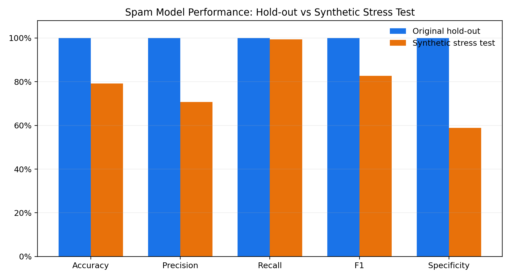
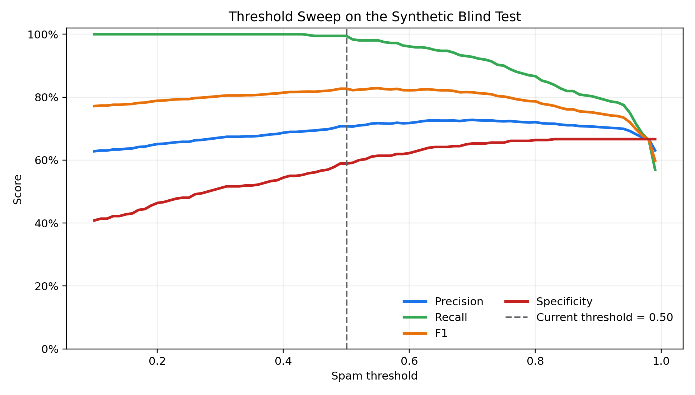
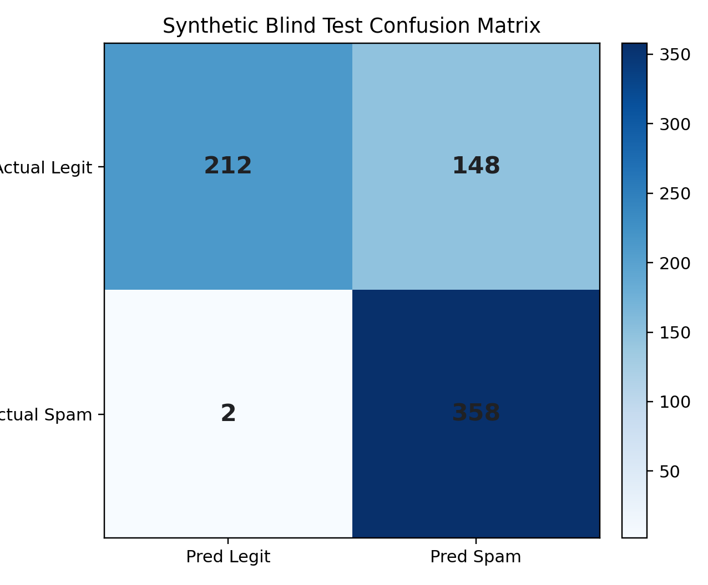
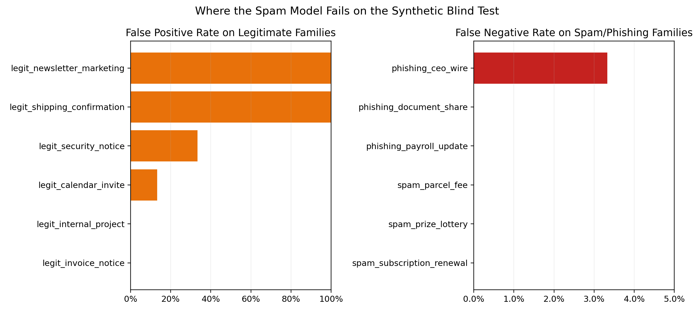
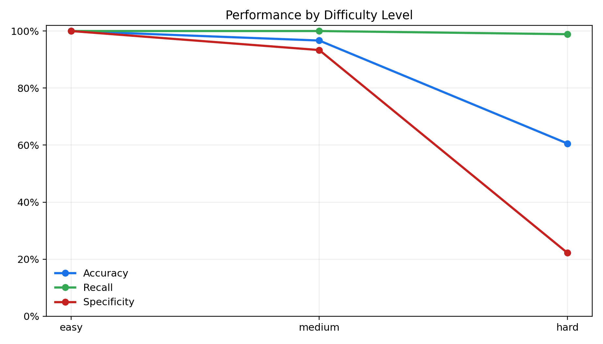
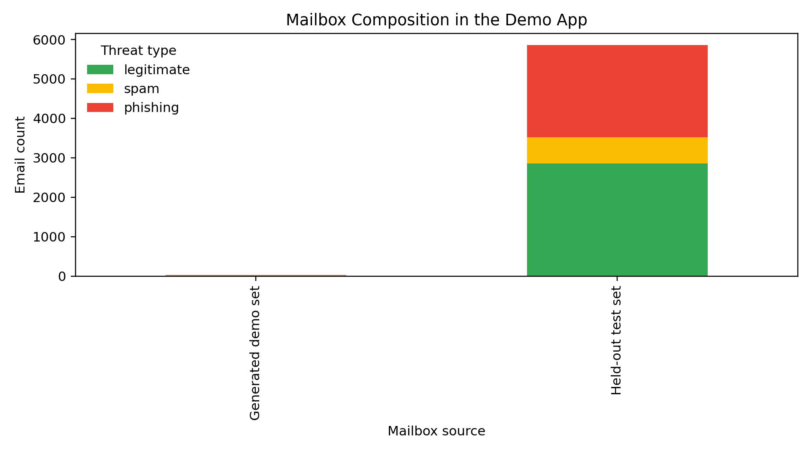
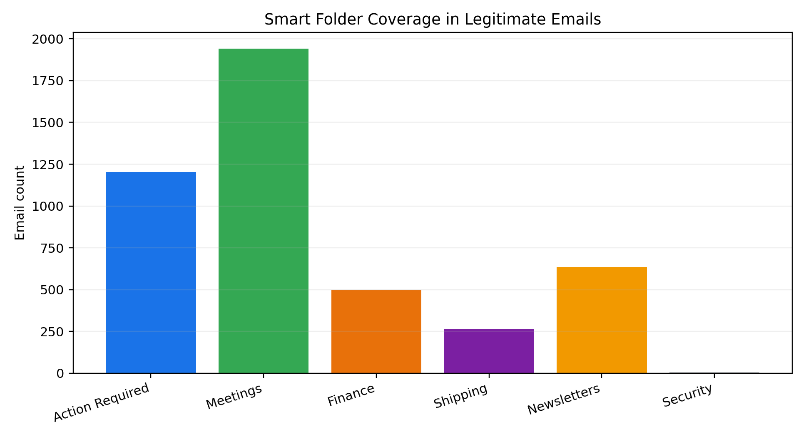

# SpamShield Final Project Submission

## 1. Project Overview

This project was developed as a full end-to-end machine learning application for email analysis. The objective was not only to classify emails as spam or non-spam, but also to estimate the business importance of legitimate emails and present the full system inside an interactive Gmail-style local application.

The project evolved in several stages:

1. Review the logic and methodology used in the previous homework notebooks.
2. Build a new final notebook from scratch rather than reuse the homework notebooks directly.
3. Select relevant quantitative and qualitative email features.
4. Train a spam classifier and an importance classifier.
5. Export trained pipelines so that the app could run without retraining every time.
6. Build a Gmail-like demo interface to visualize predictions.
7. Add a local assistant workflow and smart folder organization.
8. Stress-test the spam model on a blind synthetic dataset created after training.
9. Package all useful material into a clean submission folder.

This submission folder is therefore both:

- an academic report package
- an executable demo package

## 2. Main Deliverables

The most important folders in this submission package are:

- `01_Project_Report/`: the written report, figures, summary notes, and tables.
- `02_Notebook/`: the final notebook kept for the submission.
- `03_Datasets/`: the original datasets and the generated blind-test dataset/results.
- `04_App/`: the Gmail-style local application and its launch files.
- `05_Reproducibility/`: the modeling and evaluation scripts used to reproduce the main pipeline/export/stress-test steps.

## 3. Problem Statement

The project addresses three linked tasks:

1. Detect whether an email is legitimate or spam/phishing.
2. Estimate the importance of legitimate emails.
3. Present the results inside an interface that can be demonstrated interactively.

The final interface supports:

- spam/phishing filtering
- importance ranking
- event extraction
- smart folders
- a calendar view
- optional local LM Studio assistant integration

## 4. What Was Done From Start to Finish

### Stage 1. Review of Prior Homework Material

The first step was to review the previous homework notebooks in order to preserve course consistency:

- understand which preprocessing ideas were already introduced
- keep the project aligned with the class methodology
- go further than the homework by adding stronger validation and a deployable interface

### Stage 2. Creation of a New Final Notebook

A completely new final notebook was created for the project instead of reusing the original homework notebooks directly.

The notebook includes:

- data loading
- exploratory analysis
- preprocessing
- feature engineering
- model training
- evaluation
- interpretation
- export preparation

### Stage 3. Feature Selection

Both quantitative and qualitative variables were used.

Examples of quantitative variables:

- `hour_of_day`
- `num_received_headers`
- `num_urls`
- `num_emails_in_body`
- `num_phone_numbers`
- attachment counts
- subject/body length
- authentication pass counts

Examples of qualitative variables:

- subject text
- body text
- HTML body text
- sender domain
- SPF/DKIM/DMARC results
- user agent
- language
- reply-thread indicators

This design intentionally combined:

- text features
- metadata features
- structural email signals

### Stage 4. Spam Detection Architecture

The spam model uses a hybrid architecture:

- custom feature engineering in `email_modeling.py`
- TF-IDF text representation on combined email text
- one-hot encoding for categorical metadata
- scaled numeric features
- boolean indicators
- a balanced logistic regression classifier

This architecture was chosen because it is:

- interpretable
- relatively fast
- easy to export
- suitable for a local application

### Stage 5. Importance Estimation

A second model was built to estimate email importance on legitimate emails.

The importance task was implemented as a practical proxy target based on transparent business rules, including:

- reply-thread presence
- attachments
- finance-related vocabulary
- project-related vocabulary
- schedule/meeting vocabulary
- business domain signals
- unsubscribe and URL penalties

The output was mapped to:

- low
- medium
- high

and then converted inside the app into a 1-to-5 priority scale.

### Stage 6. Export of Trained Pipelines

The trained models were exported into reusable `.joblib` artifacts so that the application can run directly without retraining:

- `04_App/SpamShield_App/artifacts/spam_pipeline.joblib`
- `04_App/SpamShield_App/artifacts/importance_pipeline.joblib`
- `04_App/SpamShield_App/artifacts/pipeline_metadata.json`

This made the system much closer to a real product workflow.

### Stage 7. Gmail-Style Application

A Gmail-like interface was built locally in:

- `04_App/SpamShield_App/SpamShield_Gmail_App.html`
- `04_App/SpamShield_App/spamshield_app.js`
- `04_App/SpamShield_App/spamshield_server.py`

The app includes:

- inbox and spam/phishing filtering
- importance display
- threat severity display
- event extraction
- calendar view
- search
- custom spam threshold slider
- account/settings UI
- generated demo emails

### Stage 8. Smart Folders

To make the demo more advanced than a simple spam detector, smart folders were added:

- Action Required
- Meetings
- Finance
- Shipping
- Newsletters
- Security
- Generated demo emails

These folders are built automatically from content signals, event detection, metadata, and importance ranking.

### Stage 9. Blind Synthetic Stress Test

A major improvement beyond the original notebook evaluation was the addition of a blind synthetic stress test.

This was necessary because the original hold-out score on the dataset was unrealistically perfect. That usually means the dataset is too easy or contains very strong shortcut patterns.

The blind stress test therefore did the following:

1. Generate realistic synthetic email families after training.
2. Remove the `label` column before inference.
3. Score the exported spam pipeline on this new dataset.
4. Save predictions, metrics, and error analyses.

This helped evaluate whether the model generalized beyond the original train/test split.

### Stage 10. Demo-Specific Generated Emails

A curated subset of generated blind-test emails was added back into the Gmail app to make the final demonstration richer and more transparent.

The app clearly labels those emails as generated demo emails so that viewers can distinguish:

- held-out test emails from the original dataset
- synthetic demo emails used for stress-testing and presentation

## 5. Key Results

### 5.1 Original Hold-out Evaluation

On the original hold-out split, the exported spam model achieved a perfect score:

- Accuracy: 1.0000
- Precision: 1.0000
- Recall: 1.0000
- F1: 1.0000
- Specificity: 1.0000

This is included for completeness, but it should not be interpreted as sufficient proof of real-world robustness.

### 5.2 Blind Synthetic Stress Test

On the synthetic blind stress test, the same spam pipeline achieved:

- Accuracy: 0.7917
- Precision: 0.7075
- Recall: 0.9944
- F1: 0.8268
- Specificity: 0.5889

Confusion matrix:

- True negatives: 212
- False positives: 148
- False negatives: 2
- True positives: 358

Interpretation:

- The model is very strong at catching spam and phishing.
- The model is too aggressive on some realistic legitimate emails.
- The main weakness is false positives on newsletters and shipping-style legitimate emails.

This is actually an important finding because it shows critical evaluation rather than overclaiming model quality.

## 6. Included Figures

The report includes cleaned figures inside `01_Project_Report/figures/`.

### Hold-out vs Synthetic Stress Test



This figure shows that the original hold-out split was too optimistic compared with the harder blind test.

### Threshold Sweep



This plot is especially useful because it shows how recall, precision, F1, and specificity evolve as the spam threshold changes. It confirms that simply changing the threshold does not fully solve the false-positive problem.

### Confusion Matrix



This makes the classification balance easy to understand during a presentation.

### Family-Level Failure Analysis



This figure identifies which synthetic email families are hardest for the spam model.

### Performance by Difficulty



This figure shows that performance remains excellent on easy and medium cases but drops on hard cases.

### Demo Mailbox Composition



This figure summarizes what is inside the final Gmail-style application.

### Smart Folder Distribution



This figure shows how the legitimate mailbox is distributed across the smart folders.

## 7. Included Tables

The main tables are located in `01_Project_Report/tables/`.

Most useful files:

- `holdout_vs_synthetic_metrics.csv`
- `synthetic_threshold_sweep.csv`
- `synthetic_metrics_by_family.csv`
- `synthetic_metrics_by_difficulty.csv`
- `synthetic_metrics_by_broad_type.csv`
- `smart_folder_counts.csv`
- `mailbox_source_threat_counts.csv`

## 8. How to Run the Application

Install the required Python packages first if needed:

```bash
python3 -m pip install -r 04_App/requirements.txt
```

From the package root, open a terminal and run:

```bash
cd 04_App
./run_app.sh
```

Then open:

```text
http://127.0.0.1:8765
```

Optional convenience script:

`run_app.sh` is already located inside `04_App/`.

The application works without LM Studio, because a local fallback reply system is included.

If LM Studio is started separately, the app can also use the local model for assistant responses.

## 9. How to Reproduce the Main ML Steps

### Export the trained pipelines

```bash
cd 05_Reproducibility
./run_export_models.sh
```

### Run the synthetic blind stress test

```bash
cd 05_Reproducibility
./run_stress_test.sh
```

### Launch the Gmail-style demo app

```bash
cd 04_App
./run_app.sh
```

## 10. Package Structure

```text
Final_Project_Submission_Package/
├── 01_Project_Report/
│   ├── README.md
│   ├── EXECUTIVE_SUMMARY.md
│   ├── PRESENTATION_TALKING_POINTS.md
│   ├── figures/
│   └── tables/
├── 02_Notebook/
│   └── Final_Project_Spam_Importance_Analysis.ipynb
├── 03_Datasets/
│   ├── base_datasets/
│   │   ├── email_dataset_30k.csv
│   │   └── email_dataset_100k1.csv
│   └── generated_datasets/
├── 04_App/
│   ├── requirements.txt
│   ├── run_app.sh
│   └── SpamShield_App/
└── 05_Reproducibility/
    ├── email_modeling.py
    ├── export_trained_pipelines.py
    ├── synthetic_spam_blind_test.py
    ├── run_export_models.sh
    └── run_stress_test.sh
```

## 11. Main Strengths of the Project

- End-to-end machine learning workflow
- Combination of text and metadata signals
- Deployable exported pipelines
- Interactive application instead of notebook-only results
- Smart folders and calendar integration
- Honest synthetic stress testing beyond the original hold-out split
- Clear separation between model training, evaluation, and demo usage

## 12. Main Limitations

- The original dataset appears easier than real-world email traffic.
- The spam model is too aggressive on some legitimate emails with links, HTML formatting, or newsletter structure.
- Event extraction is heuristic and could be improved further with deeper calendar parsing.
- Importance is based on a proxy target, which is useful for a prototype but not a substitute for manually labeled business-priority data.

## 13. Possible Future Improvements

- Add harder legitimate emails during training.
- Calibrate the spam classifier more carefully.
- Improve event extraction from calendar invites and schedule phrases.
- Replace proxy importance labels with human-labeled importance classes.
- Extend the local assistant with richer retrieval over mailbox contents.

## 14. Final Conclusion

This project demonstrates a complete machine learning application pipeline:

- data analysis
- feature engineering
- model training
- evaluation
- model export
- deployment into a local interactive interface

The most important academic takeaway is not only that the spam model performs well, but that its weaknesses were identified through a more demanding blind synthetic evaluation. That makes the project stronger, more realistic, and more credible as a final submission.
